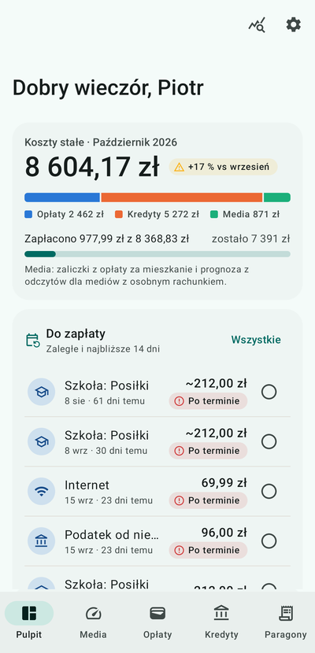
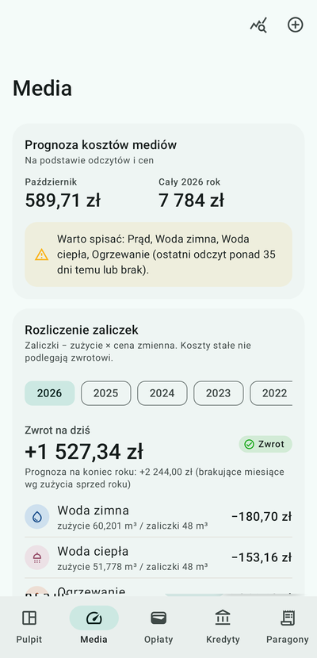
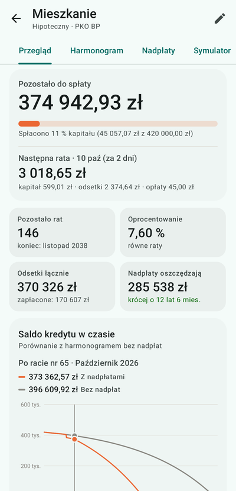
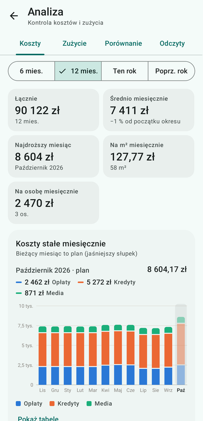
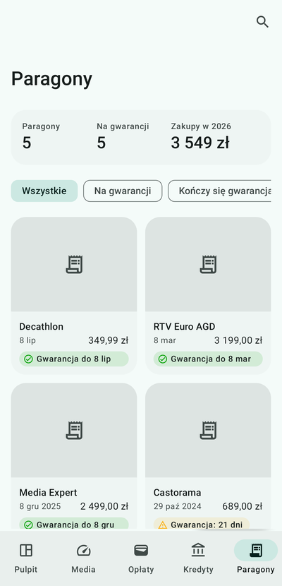
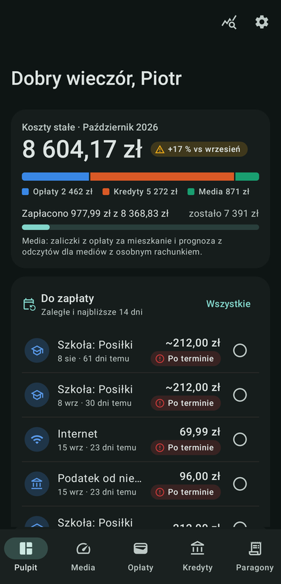

# Domowe Koszty

**Wszystkie stałe koszty mieszkania w jednym miejscu – na Twoim telefonie.**

Domowe Koszty to aplikacja na Androida, która pilnuje rachunków, liczników, kredytów
i paragonów. Pokazuje, ile kosztuje Cię dom w tym miesiącu, co trzeba jeszcze zapłacić,
ile wyjdzie zwrotu z zaliczek na media i ile zaoszczędzisz na nadpłacie kredytu.

Bez reklam, bez kont i bez wysyłania danych autorowi – wszystko zostaje na telefonie.

**[⬇ Pobierz najnowszą wersję](https://github.com/Thashar/domowe-koszty/releases/latest)**
· [Polityka prywatności](https://thashar.github.io/domowe-koszty/)

  
  
  

  
  
  

## Co potrafi

### 🏠 Pulpit
Koszty stałe bieżącego miesiąca w podziale na opłaty, kredyty i media, porównanie
z poprzednim miesiącem i lista płatności zaległych oraz na najbliższe 14 dni.
Zapłacone odhaczasz jednym dotknięciem.

### 💧 Media i rozliczenie zaliczek
Prąd, woda zimna i ciepła, ogrzewanie, gaz. Wpisujesz odczyty liczników, a aplikacja
liczy zużycie, prognozuje koszt miesiąca i całego roku oraz **na bieżąco pokazuje,
czy z rozliczenia zaliczek wyjdzie zwrot, czy dopłata**. Obsługuje wymianę licznika,
zmiany cen i zaliczki wliczone w opłatę za mieszkanie (bez liczenia ich podwójnie).

### 🧾 Opłaty
Czynsz, internet, telefon, przedszkole, ubezpieczenia, subskrypcje, IKE i wiele innych –
płatne co tydzień, co miesiąc, co kwartał albo raz w roku. Numer konta do skopiowania,
polecenie zapłaty, historia płatności, terminarz miesiąca i kwoty zmienne
(np. posiłki w szkole – kwotę podajesz przy płaceniu).

### 🏦 Kredyty
Raty równe i malejące, zmiany oprocentowania, opłaty dodatkowe i pełny harmonogram.
Nadpłaty jednorazowe i planowane co miesiąc – także „mix”, czyli stała kwota na kredyt,
z której rosnąca część idzie na nadpłatę. **Symulator** porównuje skrócenie okresu,
niższą ratę i mix, a aplikacja pokazuje, ile odsetek oszczędzasz.

### 📷 Paragony i gwarancje
Robisz zdjęcie paragonu, a aplikacja sama odczytuje sklep, datę i kwotę – na telefonie,
bez wysyłania zdjęcia do internetu. Radzi sobie z krzywymi i obróconymi zdjęciami.
Pilnuje terminów gwarancji i przypomina, zanim się skończą.

### 📊 Analiza
Koszty w czasie i ich struktura, wskaźniki na osobę i na m², zużycie rok do roku,
porównanie dowolnych miesięcy lub lat i wykrywanie nietypowego zużycia albo błędnego
odczytu. Każdy wykres ma też widok tabeli.

### 👨‍👩‍👧 Udostępnianie domownikom
Zaproś domownika kodem – tylko do podglądu albo z prawem zmian. Dane przechodzą
zaszyfrowane (AES-256) przez Twój Dysk Google, a zmiany obu osób łączą się same.

### ☁️ Kopie zapasowe i przypomnienia
Kopia do pliku albo na Dysk Google – ręcznie lub automatycznie według harmonogramu.
Przypomnienia o płatnościach, ratach, odczycie liczników i kończących się gwarancjach.

### 🔄 Aktualizacje
Aplikacja sama sprawdza, czy jest nowa wersja, pobiera ją i pokazuje, co się zmieniło.
Ty decydujesz, kiedy ją zainstalować – dane zostają.

## Instalacja

1. Na telefonie otwórz [stronę najnowszego wydania](https://github.com/Thashar/domowe-koszty/releases/latest)
   i pobierz plik `domowe-koszty-v….apk`.
2. Otwórz pobrany plik. Android zapyta o zgodę na instalowanie aplikacji z przeglądarki
   (albo z menedżera plików) – zezwól i wróć do instalacji.
3. Gotowe. Kolejne wersje aplikacja zaproponuje już sama.

**Wymagania:** Android 8.0 lub nowszy, telefon z 64-bitowym procesorem ARM
(praktycznie każdy telefon z ostatnich lat).

Aplikacji nie ma w Sklepie Play – jest udostępniana znajomym bezpośrednio, dlatego
Android przy pierwszej instalacji ostrzega o nieznanym źródle.

## Prywatność w skrócie

- Dane są zapisywane tylko na telefonie. Autor aplikacji nie ma do nich dostępu.
- Bez reklam, analityki, śledzenia i zakładania kont.
- Do internetu dane trafiają tylko wtedy, gdy sam połączysz Dysk Google – i tylko na Twój Dysk.
- Przy uruchomieniu aplikacja sprawdza tu, na GitHubie, czy jest nowa wersja – bez wysyłania Twoich danych.

Szczegóły: [polityka prywatności](https://thashar.github.io/domowe-koszty/).

## Pytania i zgłoszenia

Coś nie działa albo masz pomysł? Załóż zgłoszenie w zakładce
[Issues](https://github.com/Thashar/domowe-koszty/issues).
